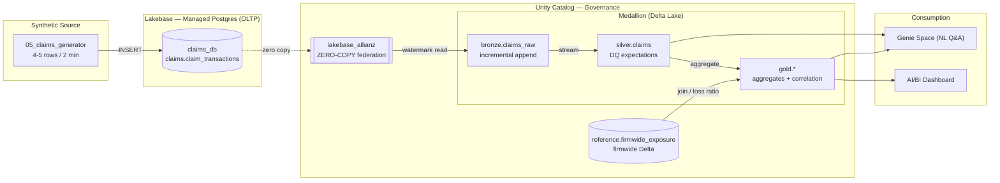

# Allianz Hackathon — Real-time Claims Streaming on Databricks

A hands-on, **notebook-driven** workshop that streams synthetic P&C **claims into Lakebase**
(managed Postgres), ingests them into the lakehouse **zero-copy via Unity Catalog**, refines
them through a **medallion architecture with data-quality checks** (Lakeflow Declarative
Pipelines), **correlates** them against a firmwide book of business, and serves the result
through an **AI/BI dashboard** and a **Genie** natural-language space.

Everything runs **inside Databricks** — the notebooks authenticate automatically as the
running user, so there is no CLI, no profile, and no workspace host to configure.
New claims land every **2 minutes** (4–5 rows) and flow end-to-end automatically.

---

## Architecture



Full write-up: [`docs/architecture.md`](docs/architecture.md). Detailed run book:
[`EXECUTION_GUIDE.md`](EXECUTION_GUIDE.md).

---

## Notebooks

Two run orders — pick one. The **default** lands claims in Lakebase; the **optional** path
lands them in Azure SQL Server. Run the notebooks top-to-bottom within whichever table you pick.

### Default path — Lakebase (run in order)

| # | Notebook | What it does |
|---|---|---|
| 00 | `notebooks/00_config` | Shared names (catalog, Lakebase, Azure SQL, schemas). `%run` by the others. |
| 01 | `notebooks/01_provision_lakebase` | Create the Lakebase (Postgres) instance via the SDK. |
| 02 | `notebooks/02_create_schema` | Create `claims_db.claims.claim_transactions` (OLTP source). |
| 03 | `notebooks/03_register_zero_copy` | **Zero-copy**: register Lakebase into UC + medallion schemas. |
| 04 | `notebooks/04_firmwide_reference` | Firmwide book-of-business Delta table (correlation). |
| 05 | `notebooks/05_claims_generator` | Synthetic claims → Lakebase (4–5 rows/batch; `once` or `loop`). |
| 06 | `notebooks/06_bronze_ingest` | Zero-copy incremental read → `bronze.claims_raw`. |
| 07 | `notebooks/07_medallion_dlt` | DLT: `silver.claims` (DQ expectations) + `gold.*` (aggregates + correlation). |
| 08 | `notebooks/08_dashboard` | Gold-layer queries for the AI/BI dashboard. |
| 09 | `notebooks/09_genie_setup` | Genie space tables, instructions, sample questions. |
| 10 | `notebooks/10_deploy_pipeline_and_jobs` | Create the medallion + the two 2-minute jobs (SDK). `engine` widget = `dlt` (default) or `batch` (schedules `07_medallion_no_dlt` when the `dlt` module is unavailable). |

### Optional path — Azure SQL Server (run in order)

An alternative OLTP source: generate the same synthetic claims every 2 minutes into an
**Azure SQL Database** rather than Lakebase. This path uses its own notebooks at the source
steps (`02a`, `05a`, `06a`) and **skips `01`** (no Lakebase to provision). The medallion, DLT,
dashboard, and Genie layers are unchanged because everything still flows through the same
`bronze.claims_raw`.

| # | Notebook | What it does |
|---|---|---|
| 00 | `notebooks/00_config` | Shared names — fill in the `TBD` Azure SQL values here first. |
| 02a | `notebooks/02a_create_schema_azuresql` | Create `claims.claim_transactions` in Azure SQL (JDBC). |
| 03 | `notebooks/03_register_zero_copy` | Create the `allianz_hackathon` catalog + medallion schemas (the zero-copy catalog it also registers is unused here). |
| 04 | `notebooks/04_firmwide_reference` | Firmwide book-of-business Delta table (correlation). |
| 05a | `notebooks/05a_claims_generator_azuresql` | Synthetic claims → **Azure SQL** (4–5 rows/batch; `once` or `loop`). |
| 06a | `notebooks/06a_bronze_ingest_azuresql` | Incremental JDBC read (watermark on `claim_txn_id`) → `bronze.claims_raw`. |
| 07 | `notebooks/07_medallion_dlt` | DLT: `silver.claims` + `gold.*` (identical to the Lakebase path). |
| 08 | `notebooks/08_dashboard` | Gold-layer queries for the AI/BI dashboard. |
| 09 | `notebooks/09_genie_setup` | Genie space tables, instructions, sample questions. |
| 10 | `notebooks/10_deploy_pipeline_and_jobs` | Set `source` = `azuresql` to schedule `05a` + `06a` every 2 minutes (+ `engine` = `dlt` or `batch`). |

Bring your own Azure SQL Server (a notebook can't provision Azure infra). In `00_config`,
fill in the `TBD` values (`AZ_SQL_SERVER`, `AZ_SQL_DATABASE`, `AZ_SQL_SECRET_SCOPE`) and store
the SQL login in a Databricks secret scope. Zero-copy federation is Lakebase-only, so the
Azure SQL path reads over JDBC rather than the zero-copy UC catalog. Pick **one** source per
`bronze.claims_raw` — don't run both `06` and `06a` against it.

---

## Quick start

1. **Add this repo to your workspace**: *Workspace → Repos → Add repo →*
   `https://github.com/saswata30/allianz_hackathon.git` (or *Git folder*).
2. Open **`notebooks/01_provision_lakebase`** and run it; wait for `AVAILABLE`.
3. Run **02 → 03 → 04** in order (each prints the next step).
4. Run **`notebooks/10_deploy_pipeline_and_jobs`** — this schedules the generator and bronze
   ingest every 2 minutes and starts the DLT pipeline. *(For a manual/live demo instead, run
   05 with `mode=loop`, then 06, then start the pipeline from 07.)*
5. Build the **dashboard** from **08** and the **Genie space** from **09**.

> **Azure SQL variant:** skip step 2, fill in the `TBD` Azure SQL config in `00_config`, then
> run `02a → 03 → 04`, and in step 4 run `10` with the `source` widget = `azuresql` (or run
> `05a` in `loop` mode + `06a` manually). See *Optional — land in Azure SQL Server* above.

> Prerequisites: a **serverless** Databricks workspace with **Lakebase** enabled, and
> permission to create catalogs, Lakebase instances, pipelines, and jobs. The workshop uses
> only the built-in runtime + SDK; `%pip` installs `psycopg2-binary`/`Faker` where needed.

---

## Data quality (medallion expectations)

Defined on `silver.claims` in `notebooks/07_medallion_dlt`:

| Rule | Type | Expectation |
|---|---|---|
| `valid_claim_id` / `valid_policy_id` | drop | keys not null |
| `positive_amount` | drop | `claim_amount > 0` |
| `valid_lob` | drop | LOB in the allowed set |
| `valid_currency` | drop | currency ∈ {EUR, GBP, CHF, USD} |
| `dates_consistent` | warn | `reported_date >= incident_date` |
| `amount_not_extreme` | warn | `claim_amount < 5,000,000` |

Dropped/flagged counts show automatically on the pipeline's `silver.claims` node.

---

## Zero-copy, in one query

After notebook 03, the live Postgres rows are queryable from the lakehouse with **no copy**:
```sql
SELECT count(*) FROM lakebase_allianz.claims.claim_transactions;
```

## Correlation, in one table
`gold.gold_loss_ratio` joins streaming incurred claims to firmwide premium →
`observed_loss_ratio` vs `target_loss_ratio` (`OVER`/`UNDER`), updated every 2 minutes.

---

## Teardown
Stop the two jobs and the pipeline, then delete the Lakebase instance and catalogs
(Compute → Database instances → delete; Catalog Explorer → delete `allianz_hackathon` and
`lakebase_allianz`). Deleting the Lakebase instance removes all OLTP data.
