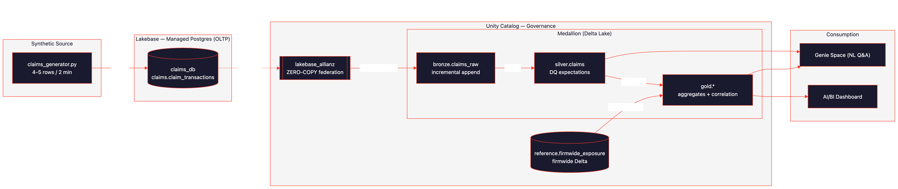
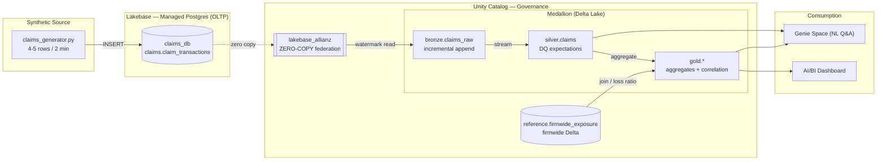
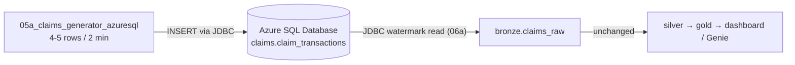

# Architecture

*(If the PNG hasn't rendered in your viewer, the same diagram is inlined below and
renders natively on GitHub.)*

## Components & data flow

| Stage | Technology | What happens |
|---|---|---|
| **1. Generate** | Python + `psycopg2` | `claims_generator.py` inserts 4–5 realistic P&C claim transactions into Lakebase every 2 minutes, simulating a live claims system. |
| **2. Land (OLTP)** | **Lakebase** (Autoscaling Postgres) | `claims_db.claims.claim_transactions` is the transactional source of truth. Scales to zero when idle. |
| **3. Zero-copy** | **Unity Catalog** federation | Lakebase is registered as UC catalog `lakebase_allianz`. Databricks queries the live Postgres rows with **no data movement / no connector**. |
| **4. Bronze** | Delta + scheduled Job | `01_bronze_ingest` reads only new rows (high-watermark on `claim_txn_id`) from the zero-copy source and appends to `bronze.claims_raw`. Idempotent. |
| **5. Silver** | **PySpark batch** (`07_medallion_no_dlt`) | `silver.claims` rebuilt from bronze with **data-quality checks**: drop rules (non-null keys, positive amounts, valid LOB/currency) and warn rules (date consistency, extreme amounts). Bad rows are dropped and counted. |
| **6. Gold** | PySpark batch tables | Aggregations by LOB/region and daily trend, plus **correlation** with the firmwide book (`gold_loss_ratio` = incurred ÷ gross written premium vs target). |
| **7. Firmwide** | Delta reference table | `reference.firmwide_exposure` holds premium/exposure by LOB × region — the denominator for loss-ratio correlation. |
| **8. Consume** | AI/BI Dashboard + Genie | Lakeview dashboard on the gold layer; Genie space for natural-language questions. |

## Why this shape
- **Lakebase for OLTP, Delta for analytics** — the right store for each job, joined by UC.
- **Zero-copy** removes the usual CDC/connector plumbing between the operational DB and the lakehouse.
- **Medallion + explicit DQ checks** make data quality a first-class, observable part of the pipeline rather than an afterthought.
- **Firmwide correlation** turns raw claim events into a business KPI (loss ratio vs plan) the moment they land.

## Optional source — Azure SQL Server

The OLTP landing zone is pluggable. Instead of Lakebase, the generator can write the same
claims into an **Azure SQL Database** (notebooks `02a` / `05a` / `06a`), and bronze ingest
reads them incrementally over **JDBC**:

Everything from `bronze.claims_raw` onward is identical to the Lakebase path. The trade-off:
Azure SQL has no Databricks **zero-copy** federation, so this path uses a real JDBC connector
(watermark on `claim_txn_id`) rather than the zero-copy UC catalog. Pick one source per
`bronze.claims_raw` — the two databases issue independent `claim_txn_id` sequences.
